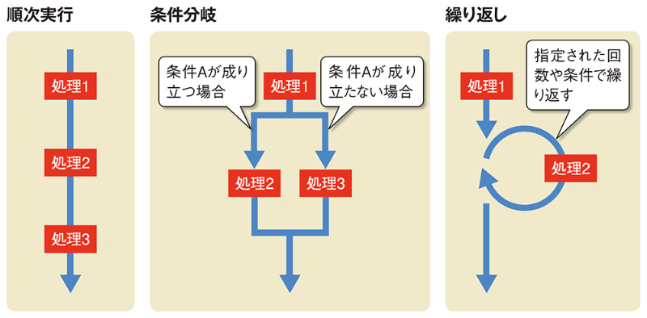
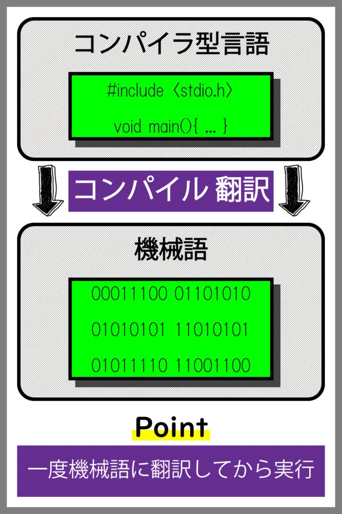
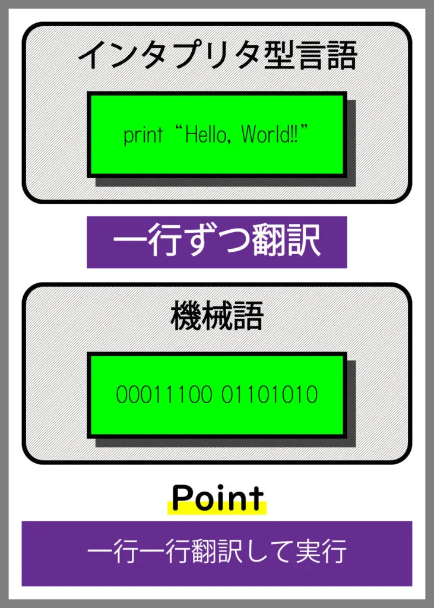

# プログラミング概論

## はじめに

第一回の資料なので、ところどころに分からない言葉があると思います。

ここに幾つかの言葉の意味を紹介しておくので、分からない言葉があれば、ここに戻って確認しましょう。

- AI・・・人工知能。人間の知能をコンピュータによって再現する技術のこと。
- C言語・・・プログラミング言語のひとつ。
- 真偽・・・「真」はあるものの結果が正しいとき、「偽」は正しくないときに使う。
- 逐一・・・順番に物事をこなすこと

ほかにも分からなかったり、さらに気になったことがあったら、インターネットで調べてみましょう！

## これから学ぶこと

みなさんは、今日から「**プログラミング**」というものを習います。

プログラミングをちょ～簡単に説明すると、**コンピュータにいろんな命令をすること**です。

プログラミングができるようになると…

- 今までできなかった複雑な計算をコンピューターに任せたり
- 自分でゲームを作れたり
- 単純な作業をコンピューターに任せたり
- 自分で AI を作れたり

大雑把ですが、このように**できることが爆発的に増えるんです**。

どうですか？ワクワクしてきましたか？

鉄は熱いうちに打てと言われるように、さっそくプログラミングを始めたいところですが…

その前に、**基本的な知識を身に着けておきましょう**。

## 大切にしてほしいこと３つ

さて、プログラミングを学ぶにあたって、以下の３つのことを忘れないでほしいと思います。

1. **分からない事があったら、すぐ聞くこと**
2. **なんでそうなるのか、考えてみること**
3. **楽しむこと**

**分からないことがあったら、すぐ聞くこと**

分からないことは恥ずかしいことではありません。

分からないことを**放置していると、もっと分からないことが増えてしまって大変**なので、どんどん質問してほしいと思います。

また、家で自主学習するときなどは、インターネットで調べてみましょう。

インターネットは偉大です。

エラーの太字部分をコピー＆ペーストして検索するだけでも解決することがよくあります。

**なんでそうなるのか、考えてみること**

プログラミングでは、**必ず因果関係が存在します**。

なぜそうなるのか、ということを考えてプログラミングをしないと、エラーが出てしまったり、正しい答えにたどり着けなくなります。

**楽しむこと**

プログラミングの中で感じた**達成感や、知的好奇心、探求心はぜひ大切に**してください。

習ったことに自分でアレンジを加えたり、作ったものを家族に見せてあげたりしてくださいね。


## プログラミングとは

## 「プログラム」と「プログラミング」

さて、今日の本題に入ります。

先ほど冒頭で述べたように、プログラミングとは**コンピュータにいろんな命令をすること**です。

そして、どうやって命令するのかというと、コンピュータ上で**「プログラム」と呼ばれる文章を書いていくのです**。

「プログラミング」と「プログラム」とはセットで覚えておきましょう。

## プログラミング言語

プログラムにも種類があり、それらはプログラミング言語として世界に数多く存在します。

以下に例を示します

- Java
- C#
- C++
- Ruby
- PHP

そして、**この塾では「Python」という言語を学びます。**

## Python について

Python は、初心者からプロのプログラマーまで幅広い人に使われているプログラミング言語です。

Python は、読みやすくて理解しやすい構文（文法）を持っているため、とっても**取っつきやすい言語**と言われています。

例えば、まった同じ内容のコードでも、Python と C 言語では全く記述量が異なります。

**C 言語の場合**

```c
#include <stdio.h>

int main(void)
{
    printf("Hello World!");
    return 0;
}
```

**Python の場合**

```python
print("Hello World!")
```

まさかの一行！！Python って素晴らしい言語ですね！！！

また、Python はさまざまなことができます。

たとえば

- ゲームを作る
- WEB サイトを作る
- データを分析する
- ロボットを制御する

などなど。

特に、**データ解析や、近年よく聞く AI などの分野で人気があります**。

## プログラミング３つの基本概念

プログラム内での命令の実行方法には、**順次実行、条件分岐、繰り返し**の 3 つの基本的な概念があります。

出典：[https://www.google.com/url?sa=i&url=https%3A%2F%2Fxtech.nikkei.com%2Fatcl%2Fnxt%2Fmag%2Fnnw%2F18%2F062400059%2F062400003%2F&psig=AOvVaw1d2OeGUxeo14LlQrtmBUM7&ust=1693881783049000&source=images&cd=vfe&opi=89978449&ved=0CBIQjhxqFwoTCJCu8cH3j4EDFQAAAAAdAAAAABAE](https://www.google.com/url?sa=i&url=https%3A%2F%2Fxtech.nikkei.com%2Fatcl%2Fnxt%2Fmag%2Fnnw%2F18%2F062400059%2F062400003%2F&psig=AOvVaw1d2OeGUxeo14LlQrtmBUM7&ust=1693881783049000&source=images&cd=vfe&opi=89978449&ved=0CBIQjhxqFwoTCJCu8cH3j4EDFQAAAAAdAAAAABAE)



1. **順次実行（Sequential Execution）**:

順次実行は、プログラム内の命令が上から下へ順番に実行される方式です。

つまり、一つの命令が実行された後、次の命令が実行されるという流れです。

順次実行は、プログラム内のタスクを一つずつ順に処理する際に使われます。

例えば、以下は Python での順次実行の例です。

```python
name = "すいず"
age = 30
print("名前:", name)
print("年齢:", age)

#出力↓
#名前：すいず
#年齢：30
```

このプログラムでは、変数に値を代入し、それを表示する命令が順番に実行されます。

1. **条件分岐（Conditional Statements）**:

条件分岐は、プログラムがある条件を評価し、その結果に応じて異なる命令を実行する仕組みです。

これにより、プログラムは特定の条件が満たされた場合と満たされない場合で異なる動作をすることができます。

日本語に置き換えるなら「もし xx なら yy する、ちがうなら zz する」みたいな感じです。

```python
if 条件:
    # 条件が正しい（＝真）の場合に実行される命令
else:
    # 条件が正しくない（＝偽）の場合に実行される命令

```

例えば、年齢によって成人かどうかを判断するプログラムは次のようになります。

```python
age = 18
if age >= 18: #ageは年齢という意味の英単語
    print("成人です")
else:
    print("未成年です")

```

このプログラムでは、年齢が 18 歳以上の場合には "成人です" が表示され、それ以外の場合には "未成年です" が表示されます。

2. **繰り返し（Loops）**:

繰り返しは、同じ命令または一連の命令を複数回実行するための仕組みです。

これにより、同じタスクを繰り返し実行したり、リスト内の要素を順番に処理したりすることができます。

例えば、1 から 10 までの数字を表示するプログラムは次のようになります。

```python
for i in range(1, 11):
    print(i)

```

このプログラムでは、1 から 10 までの数字が順番に表示されます。

これらの基本的な概念を組み合わせることで、さまざまなプログラムを作成することができます。

## コンパイラとインタープリター（おもっと知りたい人向けのおまけ）

コンパイラとインタープリターは、プログラミング言語をコンピューターが理解できる形式に変換することです。

プログラミング言語は人間が理解しやすい形式で書かれており、コンピューターはこれを直接実行できません。

そのため、プログラムをコンピューターが理解できるように変換する必要があります。

ここでは、コンパイラとインタープリターのそれぞれの概要と違いについて説明します。

**コンパイラ（Compiler）:**

コンパイラは、プログラムを一度に全体を解析し、プログラム全体を変換する方式。

コンパイラの主な特徴としては…

1. **コンパイルと実行**: プログラムをコンパイルする際に、プログラム全体が解析される。
2. **高速な実行**: コンパイル済みのプログラムは、実行時に高速に動作します。コンパイルは一度だけ行われるため、実行速度に優れている。
3. **プラットフォームで固有**: 生成されたプログラムは、特定のプラットフォーム（例：Windows、Linux、macOS）に依存することがある。異なるプラットフォームで動作するためには、各プラットフォーム向けに別々にコンパイルする必要がある。

引用：[https://www.google.com/url?sa=i&url=https%3A%2F%2Fwebpia.jp%2Finterpreter-compiler%2F&psig=AOvVaw3hB8pdpdxhirfjh_OQD9a4&ust=1693881998317000&source=images&cd=vfe&opi=89978449&ved=0CBIQjhxqFwoTCKCFtKj4j4EDFQAAAAAdAAAAABAS](https://www.google.com/url?sa=i&url=https%3A%2F%2Fwebpia.jp%2Finterpreter-compiler%2F&psig=AOvVaw3hB8pdpdxhirfjh_OQD9a4&ust=1693881998317000&source=images&cd=vfe&opi=89978449&ved=0CBIQjhxqFwoTCKCFtKj4j4EDFQAAAAAdAAAAABAS)



**インタープリター（Interpreter）:**

インタープリターは、ソースコードを逐次解釈し、その都度実行すること。

インタープリターの主な特徴としては…

1. **逐次解釈**: インタープリターはプログラムを逐次解釈し、コード行ごとに実行します。エラーは行ごとに検出され、その都度修正する必要がある。
2. **遅い実行**: インタープリターはコードを実行するたびに解釈を行うため、コンパイラに比べて実行速度が遅い。
3. **プラットフォーム非依存**: インタープリターは通常、プラットフォームに依存しない形式でプログラムを実行する。したがって、同じソースコードを異なるプラットフォーム上で実行できる。

引用：[https://www.google.com/url?sa=i&url=https%3A%2F%2Fwebpia.jp%2Finterpreter-compiler%2F&psig=AOvVaw3hB8pdpdxhirfjh_OQD9a4&ust=1693881998317000&source=images&cd=vfe&opi=89978449&ved=0CBIQjhxqFwoTCKCFtKj4j4EDFQAAAAAdAAAAABAS](https://www.google.com/url?sa=i&url=https%3A%2F%2Fwebpia.jp%2Finterpreter-compiler%2F&psig=AOvVaw3hB8pdpdxhirfjh_OQD9a4&ust=1693881998317000&source=images&cd=vfe&opi=89978449&ved=0CBIQjhxqFwoTCKCFtKj4j4EDFQAAAAAdAAAAABAS)



Python はインタープリターに分類されます。
